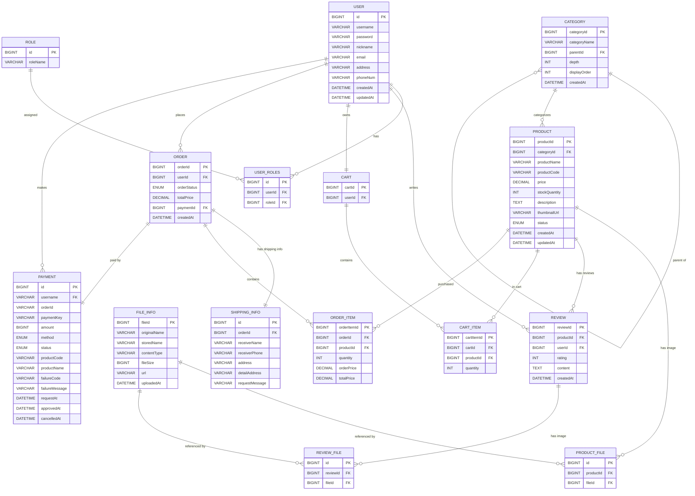

# devshop-proj

아래의 내용들은 초안입니다.


```
1. class명 container 사용 시 레이아웃에 규격 맞출 경우 사용 가능 
	-> 레이아웃 설정 이외의 화면 구현 시 다른 class 명 사용
	-> ex) 현재 이렇게 사용 중인 page: join-form | login-form


2. 헤더 푸터 붙히기
	-> nav bar 필요한 사람은 
<div class="header-wrapper has-nav">
    <div class="container">
        {{> layout/header }}
        {{> layout/nav }}
    </div>
</div>

	-> nav bar 필요없는 사람은
<div class="header-wrapper">
    <div class="container">
        {{> layout/header }}
    </div>
</div>

3. style 파일은 static/css 폴더안에 생성

4. style 파일은 mustache 파일과 1:1 매칭
	-> product-detail.mustache = product-detail.css

5. 프론트 관련 모르는건 @안미향 문의
```

---

<div align="center">

# 🛒 개발자 용품 쇼핑몰 시스템

### Developers’ Equipment Shopping Mall

<br/>


</div>

---

## 📌 프로젝트 소개

| 항목      | 내용                              |
| ------- | ------------------------------- |
| 프로젝트명   | 개발자 용품 쇼핑몰 시스템                  |
| 프로젝트 설명 | 개발자가 개발에 필요한 용품을 구매할 수 있는 웹 쇼핑몰 |
| 주요 특징   | 권한 기반 접근 제어, 파일 업로드, 결제 시스템     |
| 아키텍처    | Spring Boot 기반 MVC              |
| 템플릿 엔진  | Mustache                        |

---

## 🛠️ 기술 스택

### 📦 Backend

| 구분        | 기술              |
| --------- | --------------- |
| Language  | Java            |
| Framework | Spring Boot     |
| ORM       | Spring Data JPA |
| Database  | MySQL           |

### 🎨 Frontend

| 구분              | 기술         |
| --------------- | ---------- |
| Template Engine | Mustache   |
| Styling         | CSS        |
| Script          | JavaScript |

### ⚙️ Tools

| 구분              | 도구           |
| --------------- | ------------ |
| Version Control | Git / GitHub |
| Build Tool      | Gradle       |

---

<h3 align="center">🏅 Stats</h3>

<table width="100%" align = "center">
<tr>
  <th>팀원</th>
  <th>GitHub Stats</th>
  <th>Top Languages</th>
</tr>

<tr>
  <td align="center">
    <a href="https://github.com/Kitbomin" target="_blank" >
      <br/>
      Kitbomin
    </a>
  </td>
  <td></td>
  <td></td>
</tr>

<tr>
  <td align="center">
    <a href="https://github.com/untilthe-end" target="_blank">
      <br/>
      untilthe-end
    </a>
  </td>
  <td></td>
  <td></td>
</tr>

<tr>
  <td align="center">
    <a href="https://github.com/ehdgn" target="_blank">
      <br/>
      ehdgn
    </a>
  </td>
  <td></td>
  <td></td>
</tr>

<tr>
  <td align="center">
    <a href="https://github.com/kim-se-hoon" target="_blank">
      <br/>
      kim-se-hoon
    </a>
  </td>
  <td></td>
  <td></td>
</tr>

<tr>
  <td align="center">
    <a href="https://github.com/jihoonjeong56" target="_blank">
      <br/>
      jihoonjeong56
    </a>
  </td>
  <td></td>
  <td></td>
</tr>
</table>

---

## ✨ 주요 기능

| 기능         | 설명                       |
| ---------- | ------------------------ |
| 회원가입 / 로그인 | 사용자 인증 및 세션 관리           |
| 상품 관리      | 상품 등록, 수정, 삭제 (Owner 권한) |
| 장바구니       | 상품 추가, 수량 변경, 삭제         |
| 결제 시스템     | 주문 및 결제 처리               |
| 리뷰 시스템     | 리뷰 작성 및 이미지 첨부           |
| 권한 관리      | 역할 기반 접근 제어              |

---

## 👥 사용자 역할 및 권한

| 역할        | 권한               |
| --------- | ---------------- |
| **User**  | 상품 구매, 결제, 리뷰 작성 |
| **Owner** | 상품 등록 및 관리       |
| **Admin** | 사용자 관리, Owner 승인 |

---

## 🗂️ 프로젝트 구조

```text
📦 project
 ┣ 📂 controller
 ┣ 📂 service
 ┣ 📂 repository
 ┣ 📂 domain
 ┣ 📂 dto
 ┣ 📂 config
 ┣ 📂 util
 ┗ 📂 resources
    ┣ 📂 templates (Mustache)
    ┣ 📂 static
    ┗ 📂 application.yml
```

---

## 🖼️ 파일 관리 시스템

| 항목     | 설명                  |
| ------ | ------------------- |
| 업로드 대상 | 상품 이미지, 리뷰 이미지      |
| 저장 정보  | 원본명, 저장명, 파일 크기, 타입 |
| 연관 관계  | 상품 / 리뷰와 파일 매핑      |
| 관리 방식  | DB + 파일 시스템         |

---

## 🔐 인증 및 권한 처리

| 항목    | 내용             |
| ----- | -------------- |
| 인증 방식 | 세션 기반 인증       |
| 권한 제어 | Role 기반 접근 제어  |
| 검증 위치 | Service 계층     |
| 예외 처리 | 권한 미충족 시 예외 발생 |

---

## 📈 프로젝트를 통해 얻은 경험

| 내용                    |
| --------------------- |
| Spring Boot MVC 구조 설계 |
| JPA 연관관계 및 ERD 설계     |
| 권한 분리 및 인증/인가 처리      |
| 파일 업로드 및 관리 시스템 구현    |
| 쇼핑몰 핵심 기능 구현 경험       |

---

## 🚀 향후 개선 사항

| 개선 항목           |
| --------------- |
| JWT 기반 인증 방식 도입 |
| 관리자 대시보드 고도화    |
| 상품 검색 및 필터링     |
| 결제 시스템 고도화      |
| 테스트 코드 작성       |

---

## 📌 한 줄 요약

> **Spring Boot와 Mustache를 활용한
> 권한 기반 개발자 용품 쇼핑몰 웹 애플리케이션**



